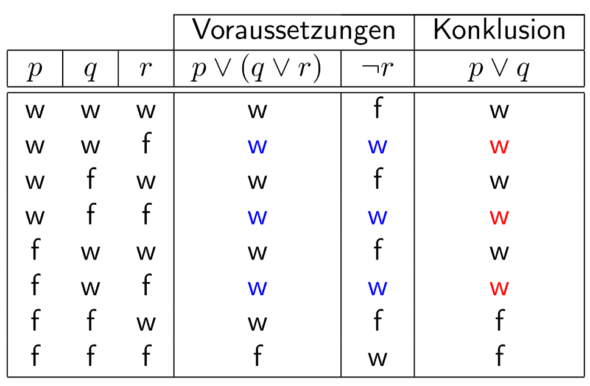
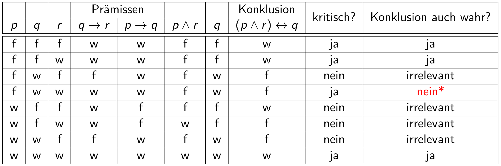

\newpage

# Aussage

Eine (elementare) Aussage beschreibt ein bestimmtes Prädikat und Subjekts das
einen eindeutigen Wahrheitswert hat.

## Beispiele

| Aussage                                 | Keine Aussage                      |
| --------------------------------------- | ---------------------------------- |
| 3 ist eine Primzahl.                    | Sie wird eine gute Informatikerin. |
| Ich glaube, dass es morgen regnen wird. | Löse die Gleichung $x^3 + 1 = 0$   |
| Die Sonne scheint.                      | Dieser Satz ist falsch.            |

Prinzip des ausgeschlossenen Dritten
:   Es gibt nur `wahr` oder `falsch`, keine dritte Option.

# Aussagenvariable

Steht für eine bestimmte Aussage

# Symbole, Junktoren

Negation
:   $\neg p$

Und
:   $p \land q$

Oder
:   $p \lor q$

Xor
:   $p \lxor q$
:   Alternative: $p \lxor q \Longleftrightarrow (p \lor q) \land \neg (p \land q)$

Implikation
:   $p \implies q$
:   Alternative: $p \implies q \Longleftrightarrow \neg p \lor q$
:   Negation: $\neg (p \implies q) \Leftrightarrow (p \land \neg q)$
:   Kontraposition: $\neg q \implies \neg q$ ist logisch äquivalent zu
    $p \implies q$

Äquivalenz
:   $p \leftrightarrow q$
:   Alternative: $p \implies q \land (q \implies p)$ oder
                 $(\neg p \lor q) \land (p \lor \neg q)$

# Aussagenlogische Begriffe

Tautologie
:   Alle Belegungen der Variablen sind `wahr`.
:   Englisch: Tautology
:   Symbol: $\top$

Kontradiktion
:   Alle Belegungen der Variablen sind `falsch`
:   Englisch: Contradiction, Unsatisfiable
:   Symbol: $\bot$

Erfüllbar
:   Mindestens eine Belegung der Variable ist `wahr`
:   English: Satisfiable

Logische Äquivalenz
:   Zwei aussagenlogische Formeln $r_1, r_2$ sind ident, wenn gilt $r_1 \leftrightarrow r_2$.
:   $r_1$ und $r_2$ müssen dieselbe Wahrheitstabelle haben.
:   $r_1 \Leftrightarrow r_2$ ist eine Meta-Aussage

Meta-Aussage
:   Eine Aussage über Aussagen
:   Eine Aussage über die Logik selbst

Aussagenlogische Formel
:   Ausdrücke die aus elementaren Aussagen und der Verknüpfungen gebildet werden können
:   - w und f sind aussagenlogische Formeln
:   - für zwei AF $p$ und $q$, sind auch $p \land q$, $p \lor q$, $p \implies q$, $p \leftrightarrow q$ und $\neg p$ aussagenlogische Formeln
:   - Keine anderen Gebilde sind AF

# Aussagenlogische Gesetze

Duale Form
:   Bei Aussagen, die nur die Junktoren $\land$ und $\lor$ enthält, ist die
    duale Formel $r^d$ jene, bei denen sowohl alle $\lor$ und $\land$ als auch
    jedes $\top$ und $\bot$ vertauscht werden. 
:   Sind $r$ und $s$ zwei logisch äquivalente Formeln, so sind auch die dazu
    dualen Formeln äquivalent:
    $$
    \text{Wenn } r \Leftrightarrow s \text{, dann } r^d \Leftrightarrow s^d
    $$
:   $\begin{aligned}
    r&: (p \land \neg q) \lor (r \land \bot) \\
    \text{dual }r&: (p \lor \neg q) \land (r \lor \top)
    \end{aligned}$ 

Substitutionsregel
:   Sei $P$ eine logische Formel und $p$ eine Variable aus $P$.
:   - Ist $P$ eine Tautologie, und ersetzt man jedes $p$ in der Formel durch 
      immer dasselbe $q$, so entsteht eine neue Formel $P_1$ die ebenfalls eine
      Tautologie.
    - Sei $q$ eine eine logisch äquivalente Aussage, also $p \Leftrightarrow q$.
      Ersetzt man in der Formel $P$ einige $p$ durch $q$, so erhält man eine neue
      Formel $P_2$ für welche gilt $P_1 \Leftrightarrow P$.

\newpage

# Logische Beweise

Schlussfolge
:   Ist eine Implikation von sogenannten Voraussetzungen (Prämissen)
    $p_1, ..., pn$ auf eine Folgerung (Konklusion / Behauptung) $q$
:   Notation: $p_1 \land p_2 \land ... \land p_n \implies q$
:   Wie Entails ($\models$) in Logic
:   { width="25em" }

Modus Ponens
:   Wenn $p \implies q$ `wahr` ist und $p$ `wahr` ist, muss $q$ `wahr` sein.
:   $\begin{aligned}
    p &\implies q \\
    p & \\
    \cline{1-3}
    \therefore ~~ q &
    \end{aligned}$

Modus Tollens
:   Wenn $p \implies q$ `wahr` ist und $\neg q$ `wahr` ist, muss $\neg p$ `wahr`
    sein.
:   $\begin{aligned}
    p &\implies q \\
    \neg q & \\
    \cline{1-3}
    \therefore ~~ \neg p &
    \end{aligned}$

Syllogismus (Kettenschluss)
:   Wenn $p \implies q$ `wahr` ist und $q \implies r$ `wahr` ist, gilt
    $p \implies r$.
:   $\begin{aligned}
    p &\implies q \\
    q &\implies r \\
    \cline{1-3}
    \therefore ~~ p &\implies r
    \end{aligned}$

Kontradiktionsregel
:   Man nimmt das Gegenteil dessen an, was man beweisen will, und führt diese
    (negierte) Aussage ad absurdum.
:   $\begin{aligned}
    \neg p &\implies \bot \\
    \cline{1-3}
    \therefore ~~ p
    \end{aligned}$

\newpage

# Bedingungen

| Bedingung                              | Erforderlich | Ausreichend |
| -------------------------------------- | :----------: | :---------: |
| Notwendige Bedingungen                 |    \cmark    |   \xmark    |
| Hinreichende Bedingungen               |    \xmark    |   \cmark    |
| Notwendig und hinreichende Bedingungen |    \cmark    |   \cmark    |

> *Die Gültigkeit des obigen Schlusses scheitert also wegen der mit \*
> gekennzeichneten Zeile. Dieser Fall ist jener, wo zwar die notwendige
> Bedingung r erfüllt ist, aber die hinreichende Bedingung p nicht gilt. Die
> Aussage q kann dennoch aus (alternativen) Gründen  $\neq p$ erfüllt, also 
> `wahr`, sein; dennoch wäre, da p falsch ist, die "gemeinsame Bedingung"
> $p \land r$ falsch, obgleich $q$ erfüllt ist. Damit ist die Schlussweise
> `falsch`, und $p \land r$ keine notwendige-und-hinreichende Bedingung für $q$*
