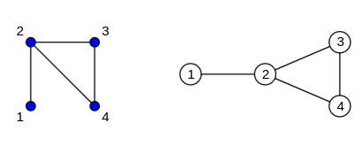
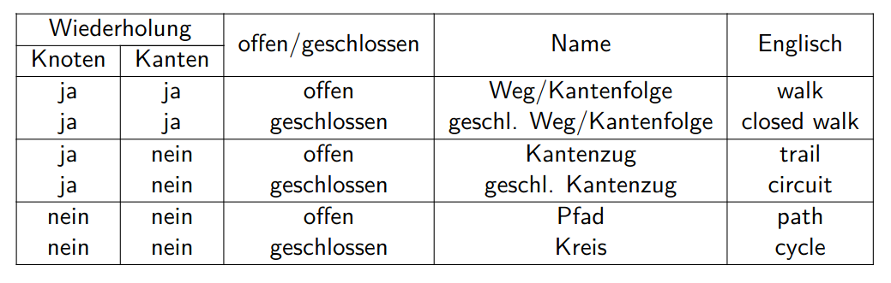
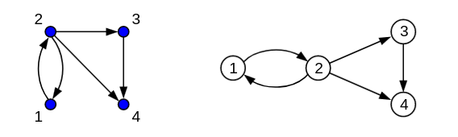

\newpage

# Ungerichtete Graphen
Ein ungerichteter Graph $G = (V, E)$, besteht aus einer Menge $V$ von Knoten (vertices)
und einer Menge $E \subseteq \{\{x,y\} \mid x,y \in V \and x \neq y\}$ von Kanten.

Die Kanten verbinden die Knoten ohne eine Richtung (daher sind sie zweielementige Mengen und keine Tupel).

Knoten werden graphisch durch Punkte und Kanten durch Verbindungslinien repräsentiert.
Der Graph $V = \{1, 2, 3, 4\}, E = \{\{1, 2\}, \{2, 3\}, \{2, 4\}, \{3, 4\}\}$ könnte z.B. so aussehen:

## Speziele ungerichtete Graphen
Vollständiger Graph
:   $K_n$ besteht aus $n$ Knoten, die alle paarweise miteinander Verbunden sind

Gittergraph
:   $M_m,n$ besteht aus $m \cdot n$ Knoten, die in einem Gitter mit $m$ Zeilen und $n$ Spalten angeordnet sind

Pfad
:   $P_n$ besteht aus $n$ Kanten und $n + 1$ Knoten, wobei aufeinanderfolgende Knoten miteinander verbunden sind

Kreis
:   $C_n$ besteht aus $n$ Knoten, die zyklisch miteinander verbunden sind

Multigraphen
:   Erlauben Mehrfachkanten und Schlingen (Kenten von einem Knoten zu sich selbst)

## Nachbarschaft
Die Menge der Kanten, die durch eine Kante mit dem Knoten v verbunden ist, ist die Nachbarschaft U(v). v ist nicht in seiner eigenen Nachbarschaft (außer er hat eine Schlinge)
$$
U(v) := \{u \in V \mid {u,v} \in E\}
$$
Der Grad von v bezeichnet die Größe der Nachbarschaft von v.
$$
g(v) := |U(v)|
$$

Handschlagslemma
:   In jedem ungerichteten Graph $G = (V, E)$ gilt $\sum_{v \in V} g(v) = 2 |E|$
:   Dies gilt, da der Grad eines Knotens die Anzahl der Kanten, die an deisem Konten anliegen ist und jede Kante an genau zwei Knoten anliegt. Somit kommen pro Kante 2 zu Summe hinzu.

Knoten ohne Nachbarn, nennt man **isoliert**.

## Begriffe
Sei $G = (V, E)$ ein Graph

adjazent
:   Die Knoten $u, v$ heißen adjazent (benachbart) wenn ${u, v} \in E$

Endknoten
:   Die Knoten $u, v$ heißen Endknoten der Kante ${u, v}$

inzident
:   ein Knoten $u$ und eine Kante $e$ heißen inzident, wenn $u$ ein Endknoten von $e$ ist

Weg w
:   Eine Folge von Knoten aus $V$, die jeweils mit dem nächsten Verbunden sind
:   $w = (v_0, ..., v_l) mit \{v_i, v_{i+1}\} \in E$

Pfad w
:   Ein Weg, bei dem alle Knoten paarweise verschieden sind (keine doppelten Knoten und Kanten)

Anfangsknoten
:   $\alpha(w) := v_0$ vom Weg w

Endknoten
:   $\omega(w) := v_l$ vom Weg w
:   Einen Weg/Pfad mit Anfgangsknoten $u$ und Endknoten $v$ nennt man u-v-Weg bzw u-v-Pfad

geschlossener Weg
:   Anfangsknoten und Endknoten sind gleich
:   $v_0 = v_l$

offener Weg
:   Anfangsknoten und Endknoten sind gleich
:   $v_0 \neq v_l$

innere Knoten
:   alle Knoten vom Weg, außer Anfangs- und Endknoten

Kreis
:   mit Länge $l \ge 3$ ist eine Folge $(v_0, ..., v_{l-1}, v_0)$
:   $(v_0, ..., v_{l-1})$ ist hierbei ein Pfad in $G$
:   $\{v_{l-1}, v_0\}$ ist hierbei eine Kante in $G$
:   Es sind keine doppelten Knoten außer am Ende wieder der Anfangsknoten erlaubt
:   Kreise der Länge 2 sind mit Mehrfachkanten möglich
:   Kreise der Länge 1 sind mit Schlingen möglich
:   **Notitz:** Prof. Rass fragen ob Kreis oder Weg

## Teilgraph
Ein Graph $H = (V_H, E_H)$ heißt Teilgraph eines Graphen $G = (V_G, E_G)$, wenn 
$V_H \subseteq V_G$ und $E_H \subseteq V_G$. Also wenn G alle Knoten und Kanten von H enthällt.

Induzierter Teilgraph
:   ist ein Teilgraph wo zusätzlich gilt, $E_H = E_G \cap \{\{u, v\} \mid u, v \in V_H\}$.
:   d.h. für alle Knoten die im Teilgraphen enthalten sind, müssen auch alle Kanten zwischen diesen Knoten enthalten sein
:   Schreibweise: $H = G[V_H]$

Aufspannender Teilgraph
:   ist ein Teilgraph wo zusätzlich gilt, $V_H = V_G$.
:   d.h. der Teilgraph enthält alle Knoten, aber nicht zwingend alle Kanten

Zusammenhangskomponente
:   ein Graph heißt zusammenhängend, wenn für jedes paar $u, v \in V$ ein u-v- Pfad existiert
:   einen Teilgraphen, der zusammenhängend ist, nennt man Zusammenhangskomponente

\newpage

# Bäume und Wälder
Kreisfreier Graph
:   enhält keinen Kreis als Teilgraph

Baum
:   ein zusammenhängender Kreisfreier Graph
:   viele Probleme, die bei allgemeinen Graphen schwer lösbar sind, sind für Bäume leicht lösbar (z.B. kürzerster Weg)
:   hat keinen bevorzugten Knoten
:   für alle Bäume gilt $|E| = |V| - 1$

Wald
:   ein Graph, dessen Zusammenhangskomponenten Bäume sind

Blatt
:   ein Knoten eines Baumes mit dem Grad 1
:   jeder Baum mit zwei oder mehr Knoten, hat mindestens zwei Blätter
:   entfernt man bei einem Baum mit zwei oder mehr Knoten ein Blatt, ist das Ergebnis noch immer ein Baum

Aufspannende Bäume
:   aufspannende Teilgraphen, die Bäume sind

\newpage

# Gerichtete Graphen
Ein gerichteter Graph (oder Digraph) $D = (V, A)$, besteht aus einer Menge $V$ von Knoten (vertices)
und einer Menge $A \subseteq V \times V$ von gerichteten Kanten (arcs).

Die Kanten verbinden die Knoten in eine Richtung (daher Tupel). Eine gerichtete Kante $(a, b)$ stellt eine Verbindung von a nach b dar und eine gerichtete Kante $(b, a)$, eine von b nach a. Es handelt sich also um zwei unterschiedliche Kanten.

Knoten werden graphisch durch Punkte und Kanten durch Verbindungslinien mit Richtungspfeil repräsentiert.
Der Graph $V = \{1, 2, 3, 4\}, E = \{(1, 2), (2, 1), (2, 3), (2, 4), (3, 4)\}$ könnte z.B. so aussehen:

Bei der gerichteten Kante $e = (u, v)$, heißt u **Anfangsknoten** $\alpha(e) := u$ und v **Endknoten** $\omega(e) := v$

## Analoge Definitionen zum ungerichteten Graphen
Folgende Eigenschaften des gerichteten Graphen lassen sich analog zum ungerichteten definieren.
Es sei $D = (V, A)$ ein gerichteter Graph.

Induzierter Teilgraph
:   Ein durch $W \subseteq V$ induzierter Teilgraph ist $D_W = D[W] := (W, A \cap (W \times W))$

Gerichteter Weg w
:   Eine Folge von Knoten aus $V$, die jeweils eine gerichtete Kante zum nächsten haben
:   $w = (v_0, ..., v_l) mit (v_i, v_{i+1}) \in A$

Gerichteter Pfad w
:   Ein gerichteter Weg, bei dem alle Knoten paarweise verschieden sind (keine doppelten Knoten und Kanten)

Gerichteter Kreis c
:   mit Länge $l \ge 2$ ist eine Folge $(v_0, ..., v_{l-1}, v_0)$
:   $(v_0, ..., v_{l-1})$ ist hierbei ein gerichteter Pfad in $G$
:   $(v_{l-1}, v_0)$ ist hierbei eine Kante in $G$
:   Es sind keine doppelten Knoten außer am Ende wieder der  Anfangsknoten erlaubt
:   Kreise der Länge 2 sind möglich, da man zwischen zwei Knoten eine Kante hin und eine Kante zurück machen kann.
:   Kreise der Länge 1 sind mit Schlingen möglich

## Zusammenhang
Es sei $D = (V, A)$ ein gerichteter Graph. Zwei Knoten heißen stark zusammenhängend $(u ~ v)$, falls in D sowohl ein u-v-Pfad und ein v-u-Pfad existiert. (jeder Knoten ist mit sich selbst stark zusammenhängend).

Wenn $u ~ v$ und $v ~ w$ dann gilt auch $u ~ w$, somit ist starker Zusammenhang transitiv.

Der Graph D heißt:

- stark zusammenhängend,
:   wenn für jedes Paar $u, v \in D$ ein gerichteter u-v-Pfad existiert.
:   ein Graph mit nur einem Knoten ist immer stark zusammenhängend.

- schwach zusammenhängend
:   falls der zugrundeliegende ungerichtete Graph zusammenhängend ist.
:   mit anderen Worten: wenn kein Knoten bei einem Graph mit $|V| > 1$ keine eingehenden oder ausgehenden Kanten hat.

Starke Zusammenhangskomponente:
:   ein Teilgraph eines gerichteten Graphen, der stark zusammenhängend ist.
:   die Zusammenhangskomponenten teilen den ungerichteten Graphen in Äquivalenzklassen ein

## Nachbarschaft
Es sei $D = (V, A)$ ein gerichteter Graph.

Nachfolgermenge:
:   $N(u) := {v \in V \mid (u,v) \in A}$
:   alle Knoten auf die eine Kante (kein Pfad!) von u hingeht

Vorgängemenge:
:   $V(u) := {v \in V \mid (v,u) \in A}$
:   alle Knoten auf die eine Kante (kein Pfad!) auf u hingeht

Außengrad:
:   $g^+(u) := |N(u)|$
:   Anzahl der ausgehenden Kanten

Innengrad:
:   $g^-(u) := |V(u)|$
:   Anzahl der eingehenden Kanten

Grad:
:   $g(u) = g^+(u) + g^-(u)$
:   Außengrad + Innengrad

## Grafische Dartellung von Relationen
Die Relation $R \subseteq M \times M$ kann als Graph $G = (M, R)$ grafisch dargestellt werden.
Jedes Tupel der Relation wird somit zu einer gerichteten Kante, zwischen den Werten der Grundmenge.

Einige Eigenschaften von Relationen können so grafisch erkannt werden

- Symmetrie:
:   alle Knoten, die mit Kanten verbunden sind, müssen in beide Richtungen verbunden sein.

- Reflexivität:
:   Schlingen an allen Knoten

- Transitivität:
:   Für alle Knotentripel $a,b,c$, wo a mit b, und b mit c verbunden ist, muss auch eine Kante von a nach c existieren.

## Bewerter Graph
Ein bewerteter Graph $G = (V, E, c)$ besteht aus einem (gerichteten/ungerichteten) Graphen aus $V$ und $E$ und einer Bewertungsfunktion $c: E \implies \R$ (cost). Diese ordnet den Kanten eine (numerische) Bewertung (Gewichte, Längen, Kosten, etc.) zu.

Die Länge $c(G)$ ist die Summe der Bewertungen aller Kanten des Graphen.

Ist die Bewertungsfunktion auf Knoten statt Kanten definiert ($c: V \implies \R$), spricht man von eine Graph mit Labels.

### Entfernung
Die Entfernung d zwischen zwei Knoten u und v, ist die Länge (Summe der Kosten) des minimalen Weges zwischen den Knoten (wobei minimal nicht durch die Anzahl der Kanten bestimmt wird, sondern die Kosten).

Entfernung d, Länge des kürzesten Wegs zwischen zwei Knoten, sonst unendlich.

Kürzester Weg sp()

Negative Gewichte => können Problemen beim Wegfinden in Kreisem machen

## Distanzgraph
Bewertungsfunktion auf $\R_0^+$.

Gut zum finden von kürzesten Wegen, da der Entfernung

## Wurzelbäume
Wurzel gibt implizit richtung vor
Jeder Knoten hat einen Pfad zur Wurzel
Zwischen zwei Knoten genau ein Pfad
Vorgänger: Knoten am
Nachfolger

## k-ärer, binärer, vollständiger, perfekter WB

Prof. Rass fragen: hat ein Baum mit nur einer Wurzel ein Blatt?

## Graphenisomorphie
$G_1 = $

