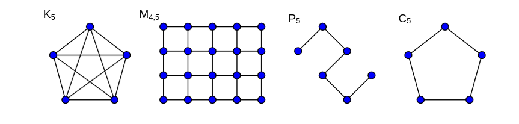

\newpage

# Ungerichtete Graphen
Ein ungerichteter Graph $G = (V, E)$, besteht aus einer Menge $V$ von Knoten (vertices)
und einer Menge $E \subseteq \{\{x,y\} \mid x,y \in V \and x \neq y\}$ von Kanten.

Die Kanten verbinden die Knoten ohne eine Richtung (daher sind sie zweielementige Mengen und keine Tupel).

Knoten werden graphisch durch Punkte und Kanten durch Verbindungslinien repräsentiert.
Der Graph $V = \{1, 2, 3, 4\} E = \{\{1, 2\}, \{2, 3\}, \{2, 4\}, \{3, 4\}\}$ könnte z.B. so aussehen:

## Speziele ungerichtete Graphen
Vollständiger Graph
:   $K_n$ besteht aus $n$ Knoten, die alle paarweise miteinander Verbunden sind

Gittergraph
:   $M_m,n$ besteht aus $m \cdot n$ Knoten, die in einem Gitter mit $m$ Zeilen und $n$ Spalten angeordnet sind

Pfad
:   $P_n$ besteht aus $n$ Kanten und $n + 1$ Knoten, wobei aufeinanderfolgende Knoten miteinander verbunden sind

Kreis
:   $C_n$ besteht aus $n$ Knoten, die zyklisch miteinander verbunden sind

Multigraphen
:   Erlauben Mehrfachkanten und Schlingen (Kenten von einem Knoten zu sich selbst)

## Nachbarschaft
Die Menge der Kanten, die durch eine Kante mit dem Knoten v verbunden ist, ist die Nachbarschaft U(v).
$$
U(v) := \{u \in V \mid {u,v} \in E\}
$$
Der Grad von v bezeichnet die Größe der Nachbarschaft von v.
$$
g(v) := |U(v)|
$$

Handschalglemma
:   In jedem ungerichteten Graph $G = (V, E) gilt $sum_{v \in V} g(v) = 2 |E|$
:   Dies gilt, da der Grad eines Knotens die Anzahl der Kanten, die an deisem Konten anliegen ist und jede Kante an genau zwei Knoten anliegt. Somit kommen pro Kante 2 zu Summe hinzu.

## Begriffe
Sei $G = (V, E)$ ein Graph
adjazent
:   Die Knoten $u, v$ heißen adjazent (benachbart) wenn ${u, v} \in E$
Endknoten
:   Die Knoten $u, v$ heißen Endknoten der Kante ${u, v}$
inzident
:   ein Knoten $u$ und eine Kante $e$ heißen inzident, wenn $u$ ein Endknoten von $e$ ist
Weg w
:   Eine Folge von Knoten aus $V$, die jeweils mit dem nächsten Verbunden sind
:   $w = (v_0, ..., v_l) mit \{v_i, v_i+1\} \in E$
Pfad w
:   Ein Weg, bei dem alle Knoten paarweise verschieden sind
geschlossene Kantenfolge
:   $v_0 = v_l$
offene Kantenfolge
:   $v_0 \neq v_l$

