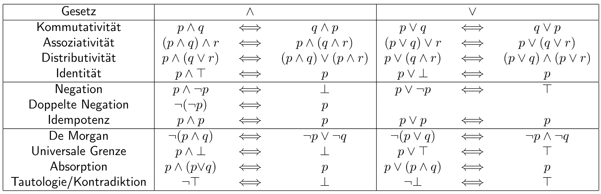

\newpage

# Aussagen- und Prädikatenlogik

- **Was versteht man unter Aussagen, Aussageformen, und wie können (einfache) Aussagen/Aussageformen zu komplexeren Aussagen/Aussageformen verknüpft werden?**

   1. Aussagen: Wahrheitsgehalt muss eindeutig zuordenbar sein. Entweder atomar oder durch Junktoren verknüpft.
      Zuordnung eines bestimmten Prädikats zu einem bestimmten Subjekt.
   2. Aussageform: Zuordnung eines bestimmten Prädikats zu einem variablen Subjekt.

- **Was versteht man unter einer logischen Implikation und einer logischen Äquivalenz? Wie können diese zur Überprüfung von Wahrheitsgehalten angewandt, bzw. selbst auf ihren Wahrheitsgehalt überprüft werden?**
  
   1. Logische Implikation: $p(x) \Implies q(x)$, wenn $p(x)$ wahr ist,
      muss auch $q(x)$ gelten. 
   2. Logische Äquivalenz: $p(x) \Equiv q(x)$, $p(x)$ und $q(x)$
      müssen für dieselben $x$ dieselben Werte ergeben. Die
      Wahrheitstabellen sind ident.

- **Welche Arten logischen Schlussfolgerns gibt es?**

   1. Modus Ponens
   2. Modus Tollens
   3. Syllogismus
   4. Beweis durch Widerspruch

- **Was ist ein Prädikat und Prädikatenlogik?**

   1. Prädikat: Eine Aussage die einem konkreten Subjekt zugeordnet.
      = Aussagenlogische Formel. Eine Funktion, die einem Subjekt $x$
      einen Wahrheitswert zuordnet.
   2. Prädikatenlogik: Lässt die Subjekte variable.

- **Was sind All- und Existenzquantoren? Welche Gesetzmäßigkeiten gelten hierfür?**

   1. Allquantor: $\forall x \in X: p(x)$, muss für alle möglichen $x$
                  aus der Grundmenge $X$ stimmen.
   2. Existenzquantor: $\exists x \in X: p(x)$, muss für mindestens ein $x$
                       aus der Grundmenge $X$ stimmen.

- **Welche Gesetze der Aussagen- und der Prädikatenlogik kennen Sie?**

   { height="20%" }

- **Was sind mathematische Definitionen und Sätze? Was versteht man unter einem Beweis?**

   1. Mathematische Definition: Man führt etwas neues ein und beweist
                                es mit bereits bestehenden Sätze.
   2. Mathematische Sätze: Gesetzmäßigkeiten von großer Relevanz.
   3. Beweis: Anhand von existenten Wissen mit klaren Techniken auf
              neues Wissen führen.
