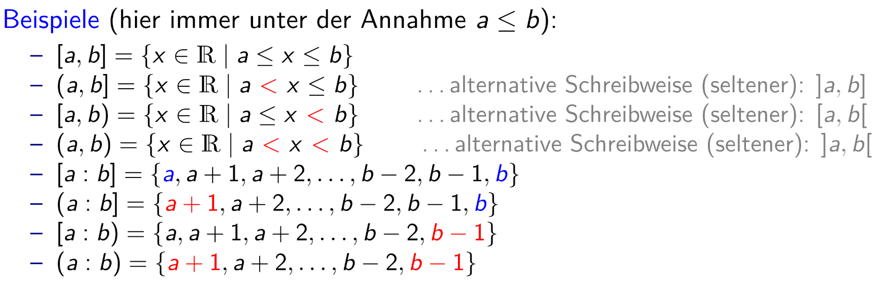
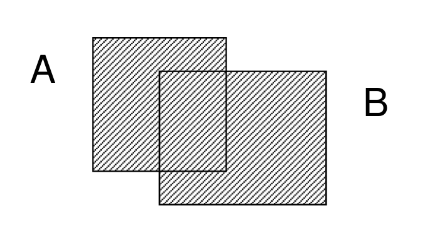
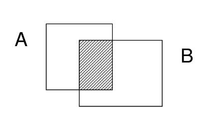
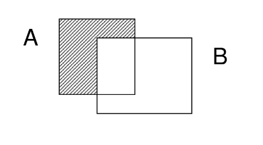
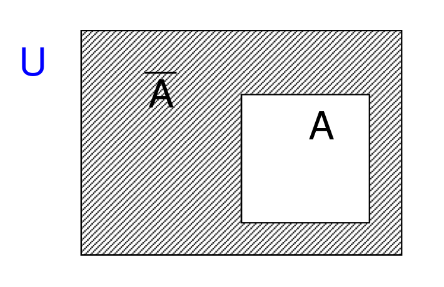
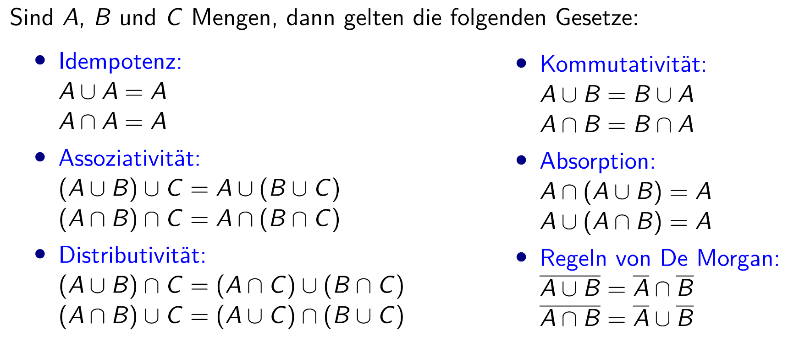
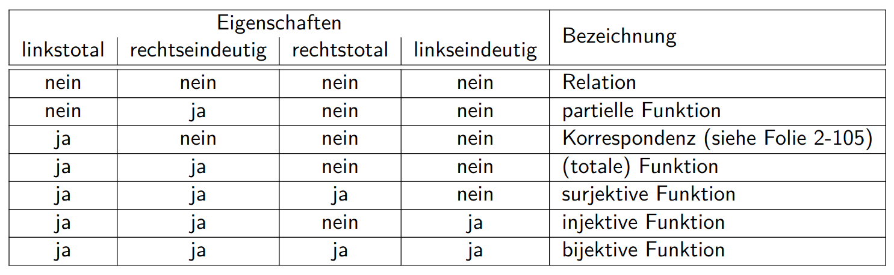

\newpage

# Mengen -- Einführung

> *Unter einer Menge (engl. set) versteht man eine Sammlung von
> bestimmten, wohlunterschiedenen Objekten unserer Anschauung
> oder unseres Denkens, welche die Elemente der Menge genannt werden,
> zu einem Ganzen.*

- Die Reihenfolge von Elementen in einer Menge ist irrelevant.
- Doppelte Elemente sind verboten (alle Elemente müssen unterscheidbar sein)
- Mengen sind ident, wenn sie dieselben Elemente haben.

Mengen per Angabe
:  $\{ x \in \N \mid x < 4 \} \infix \{ 1, 2, 3 \}$

Alphabet
:  $\Sigma = \{ a, b, c, ... \}$
:  $\Sigma^* = \{ a, ab, abc, abcd, ... \}$ alle möglichen Wörter

Worte
:  Zeichenketten aus mehreren Zeichen aus $\Sigma$.
:  Symbol für leeres Wort: $\epsilon$

Sprache
:  Eine Menge aus Worten nennt man eine Sprache und wird als $L$
   bezeichnet.

Konkatenationsoperator
:  Kombiniert das Wort auf der linken mit dem Wort auf der rechten
   Seite.
:  Operator: $a || b \infix ab$

Plus Operator
:  Eine Menge $M$ plus ein Element $a$: $M + a$ beschreibt meist das
   hinzufügen des Elements $a$ zur Menge $M$.

Intervalle
:  in dem Mengen $\N, \Z$ oder $\R$ werden durch Angabe von Intervallgrenzen
   angegeben.

   - Eckige Klammer: Intervallgrenze gehört zur Menge,
     Runde Klammer: Intervallgrenze gehört nicht zur Menge.

   - Komma als Trennzeichen: Grundmenge $\R$;
     
     Doppelpunkt als Trennzeichen: Grundmenge $\N$ oder $\Z$.
     
   

## Begriffe

Teilmenge, Obermenge
:  Eine Menge $A$ ist eine Teilmenge der Menge $B$, wenn gilt:
   $\forall x \in A: x \in B$.
:  $A$ ist eine echte Teilemenge, wenn gilt:
   $(\forall x \in A: x \in B) \land A \neq B$
:  Die Leere Menge $\emptyset$ ist immer eine Teilmenge einer jeden
   Menge
:  $B$ ist hier die Obermenge.

Gleichheit
:  $A = B \Equiv (A \subseteq B) \land (B \subseteq A)$
:  $A = B \Equiv (\forall a \in A: a \in B) \land (\forall b \in B: b \in A)$

\newpage

Kardinalität
:  Anzahl an Elemente in einer Menge
:  Schreibweise: $|A|$
:  $|\emptyset| = 0$
:  $|\{ \emptyset \}| = 1$
:  Für endliche Mengen $M, N$ gilt: $|M \times N| = |M| \cdot |N|$

Potenzmenge
:  Die Menge aller Teilmengen einer Menge $M$.
:  Schreibweise: $2^M$ oder $\P(A)$.
:  Für eine Menge $M$ mit $n = |M|$ Elementen hat die Potenzmenge
   $\P(M)$ genau $|\P(M)| = 2^n$ viele Elemente.

Vereinigung
:  $A \cup B \coloneqq \{ x \mid x \in A \lor x \in B \}$
:  { height="7em" }

Durchschnitt
:  $A \cap B \coloneqq \{ x \mid x \in A \land x \in B \}$
:  { height="7em" }

Differenz
:  $A \setminus B \coloneqq \{ x \mid x \in A \land x \notin B \}$
:  { height="7em" }

Komplement
:  ist $A \subseteq U$[^1], so heißt die Menge $U \setminus A$ das
   Komplement von $A$ bzgl. $U$
:  Schreibweise: $\overline{A}$
:  { height="8em" }

[^1]: Beim Komplement wird auf die übergeordnete Menge $U$ (genannt
      Universum) häufig kein (besonderer) Bezug genommen.

*Analog zu Logic*

Disjunkt
:  Beschreibt zwei Mengen $A$ und $B$ die keine gemeinsamen Elemente
   haben.
:  $A \cap B = \emptyset$

# Kartesisches Produkt

Tupel
:  Anneinanderreihung von Objekten
:  Mehrfachwerte sind erlaubt
:  Reihenfolge ist relevant

Für zwei Mengen $A$, $B$ nennen wir die Menge

$$
A \times B \coloneqq \{ (a, b) \mid a \in A, b \in B \}
$$

als kartesisches Produkt von $A$ und $B$, gelesen als "$A$ kreuz $B$".
Die Elemente dieser Menge heißen (geordnete) Paare (2-Tupel).

## Mehrfaches kartesisches Produkt

Für zwei oder mehr Mengen $A_1, A_2, ..., A_n$ ist das $n$-fache
kartesisches Produkt die Menge:

$$
\bigtimes_{i=1}^n A_i = A_1 \times A_2 \times ... \times A_n = \{ (a_1, a_2, ..., a_n) \mid a_1 \in A_1, a_2 \in A_2, ..., a_n \in A_n \}
$$

Ihre Elemente heißen geordnete $n$-Tupel.

- Sind alle $A_i$ gleich $A$, so schreiben wir statt $A \times ...
  \times A$ auch kurz $A^n$.

  $A^0 \coloneqq \emptyset, A^* \coloneqq \bigcup_{i=0}^{\infty} A^i, A^+ \coloneqq \bigcup_{i=1}^{\infty} A_i$

- Das mehrfache kartesische Produkt ist **nicht assoziativ**.

  $A \times A \times A \neq (A \times A) \times A \neq A \times (A \times A)$

- Das mehrfach kartesische Produkt ist **nicht kommutativ**.

  $A \times B \neq B \times A$

- Das mehrfach kartesische Produkt ist distributiv.

  $L \times (M \cap N) = (L \times M) \cap (L \times N)$
  
  $(L \cap M) \times N = (L \times N) \cap (M \times N)$

# Relationen

Eine Relation $R$ zwischen den Mengen $M, N$ beschreibt eine
Teilmenge des kartesischen Produkts von $M$ und $N$:

$$
R \subseteq M \times N
$$

$R$ ist also das kartesische Produkt $M \times N$ auf das ein Filter
angewandt wird. (Vergleichbar mit dem `WHERE` statement aus SQL oder
dem $\sigma$ aus der relationalen Algebra.)

Man kann $R$ auch als eine Zuordnung von Elementen aus $N$ zur (evtl. mehreren) Elementen aus $N$ sehen.

Häufig genutzte Relationen bei Zahlen
:  $=, \neq, <, >, \leq, \geq$

- Relationen sind gut darstellbar als gerichtet Graphen.

- $R \subseteq A \times A$ heißt reflexiv $\infix \forall a \in A: (a, a) \in R$
  
  - Die $<$- und $\neq$-Relationen sind nicht reflexiv.
  - Die $\leq$- und $=$-Relationen sind reflexiv.

- $R \subseteq A \times A$ heißt symmetrisch $\infix (a, b) \in R \Implies (b, a) \in R$

   - Symmetrische Relationen können ohne Pfeile dargestellt werden.

- $R \subseteq A \times A$ heißt antisymmetrisch $\infix [(a, b) \in R \land (b, a) \in R] \Implies a = b$

   - Intuitiv: Wenn beide Relationen gelten, ann muss es sich um das gleiche Element handeln.

- $R \subseteq A \times A$ heißt transitiv $\infix (a, b) \in R \land (b, c) \in R \Implies (a, c) \in R$

   - $<, >$ und $\prec$ (kürzer) sind transitiv.

## Verkettungsoperator

Es seien $A, B$ und $C$ Mengen, und zwei Relationen $R_1 \subseteq A
\times B$ und $R_2 \subseteq B \times C$ gegeben. Dann nennt man die
Menge

$$
\{ (x, z) \mid \exists y: (x, y) \in R_1, (y, z) \in R_2 \}
$$

die Verkettung on $R_1$ und $R_2$, und schreibt hierfür $R_1 \circ R_2$.

## Inverse Relation

Es seien $A, B$ Mengen. Ist eine Relation $R \subseteq A \times B$ gegeben,
so nenne wir die Menge

$$
R^{-1} = \{ (b, a) \mid (a, b) \in R \}
$$

die inverse Relation.

- Die inverse Relation ist nur für das kartesische Produkt zwischen
  zwei Mengen definiert.

## Äquivalenzrelation

Die Relation $R \subseteq M \times M$ heißt Äquivalenzrelation (über $M$)
$\infix R$ ist **reflexiv**, **symmetrisch** und **transitiv**. Solche
Relationen werden mit $\sim$ notiert; man schreibt $a \sim b$ anstatt
$(a, b) \in R$ oder $a ~ R ~ b$.

Für ein Element $x \in M$ heißt die Menge

$$
[x] = [x]_{\sim} \coloneqq \{ y \in M \mid y \sim x \},
$$

die durch $x$ repräsentierte **Äquivalenzklasse**. Die Annotation $\sim$
kann entfallen, wenn die zugehörige Relation aus dem Kontext heraus
klar ist.

### Beispiel

Angenommen $A$ beschreibt das Alter aller Personen und die Relatione
$R \subseteq A \times A$ fasst alle Personen mit demselben Alter in
2-Tupel zusammen.

$R$ ist sowohl reflexiv, symmetrisch, als auch transitiv $\Implies$ $R$
ist eine Äquivalenzrelation. 

Die Äquivalenzklasse $[18]$ ist dann die Menge aller Personen aus $A$,
die 18 Jahre alt sind.

**Allgemein**

$[x]$ ist die Menge aller Personen aus $A$, die $x$ Jahre alt sind.

## Partitionen

Es sei $M$ eine Menge, und $\mathcal{Z} \subseteq \P(M)$ eine Familie
nicht-leerer Teilmengen von $M$. Wir nennen $\mathcal{Z}$ eine
Partition (Zerlegung) der Menge $M$, wenn zwei Bedingungen erfüllt
sind:

1. $\bigcup_{X \in \mathcal{Z}} X = M$, d.h. die Vereinigung der Mengen
   in $\mathcal{Z}$ ergibt die gesamte Menge $M$.
2. Für alle $X, Y$ und $Z$ mit $X \neq Y$ gilt $X \cap Y = \emptyset$, d.h.
   die Elemente in $Z$ sind paarweise disjunkt.

Es sei $\sim$ eine Äquivalenzrelation auf $A$, dann bilden die
Äquivalenzklassen von $R$ eine Partition von $A$. Umgekehrt legt
jede Partition einer Menge $A$ auch eine Äquivalenzrelation fest.

- Schreibweise für die von einer Äquivalenzrelation erzeugten Partitionen
  rechtfertigt, nämlich das Symbol

  $$
  A ~/ \sim \coloneqq \{ [x]_{\sim} \mid x \in A \}
  $$

  welche wir als Quotienten-Menge oder Faktormenge bezeichnen. Sie
  besteht aus allen Äquivalenzklassen der Relatione $\sim$.

### Beispiel

Man nimmt an die Menge $M = \{ a, b, c, d, e, f, g \}$ und $\mathcal{Z} 
\{ \{ a, b, e \}, \{ c \}, \{ f \} \}$. Eine Partition zerlegt
also die Menge $M$ in $n$ Untermengen. Jedes Element $m \in M$ darf in
allen $n$ Untermengen lediglich einmal vorkommen $\Implies$ Die
Vereinigung aller Untermengen aus $\mathcal{Z}$ ist mit der ursprünglichen
Menge $M$ ident. 

## Ordnungsrelation

Sei $M$ eine Menge, und $R \subseteqq M \times M$ eine Relation. Wir nennen
$R$ eine:

- Partielle Ordnung oder Halbordnung $\infix R$ ist **reflexiv**,
  **antisymmetrisch** und **transitiv**.
- Totale Ordnung $\infix R$ ist **reflexiv**, **antisymmetrisch**,
  **transitiv** und für alle $(a, b \in M \times M)$ gilt entweder
  $(a, b) \in R$ oder $(b, a) \in R$.

  Das heißt, alle Elemente sind im Sinne von $R$ vergleichbar.

### Minimale / Maximale Elemente

- Betrachten wir (partielle oder totale) Ordnungen, dann stellt sich
  unmittelbar die Frage nach einem kleinsten bzw. größten Element
  im Sinne der Ordnung.

Es sei $R \subseteq A \times A$ eine partielle Ordnung. Das Element
$a \in A$ heißt minimal (bzgl. der partiellen Ordnung $R$), wenn kein
Element $b \neq a$ existiert, sodass $(b, a) \in R$.

Analog dazu heißt das Element $a$ maximal (bzgl. der partiellen
Ordnung $R$) wenn es kein Element $(a, b) \in R$ gibt.

- Ein Minimum bzw. Ein Maximum ist ein besonders minimales bzw.
  maximales Element, nämlich eines, das mit allen anderen Elementen
  vergleichbar ist.

#### Beispiel 1

Stellt man sich eine Ordnungsrelation als eine Folge von Pfeilen
vor: $\{ a \implies a, a \implies b , b \implies c,
c \implies d, d \implies e, e \implies e \}$ dann
ist ein minimales Element jenes, auf das kein anderes Element zeigt.
Das Element selbst darf auf sich selbst zeigen.

Analog dazu beschreibt maximal jene Elemente, die auf keine anderen
Elemente zeigen. Auch hier darf das Element wieder auf sich selbst
zeigen. Es kann allerdings auch mehrere Elemente geben,
auf die diese Eigenschaft zutrifft.

In diesem Fall wäre das minimale Element $a$ und das maximale $e$.

\newpage

#### Beispiel 2

Beispiel mit Hilfe eines Hasse-Diagramms:

In diesem Beispiel wären $e, d$ maximale Elemente und $c$ ein
minimales Element. In diesem Beispiel gibt es zwar kein Maximum,
allerdings ist $e$ ein Minimum.

## Teilbarkeitsrelation

- Es seien $x, y \in \N$, dann schreiben wir $x \mid y$, falls $x$
  ein Teiler von $y$ ist. Formal: $x \mid y$ wenn ein $k \in \N$
  existiert, sodass $y = k \cdot x$ gilt.

- Teilbarkeit ist eine partielle Ordnung.
- Sie liefert auch eine Äquivalenzrelation, durch folgende Festlegung:
  
  Es sei $n \in \N$ mit $n > 1$ beliebig, aber fest, vorgegeben. Dann
  definieren wir die Relation

  $$
  \begin{aligned}
  a \congruence_n b : &\Leftrightarrow n \mid (b - a) \\
                      &\Leftrightarrow (a \mathrm{~mod~} n = b \mathrm{~mod~} n)
  \end{aligned}
  $$

### Rechenregeln für den $\ggT$

- $\ggT(x, y) \mid x$ und $\ggT(x, y) \mid y$
- Für alle gemeinsamen Teiler $t$ von $x$ und $y$ gilt auch $t \mid \ggT(x, y)$
- Für alle $m \in \N$ mit $m \geq 1$ gilt $ggT(m \cdot a, m \cdot b) = m \cdot \ggT(a, b)$.
- Ist $\ggT(a, b) = t$ so gilt $\ggT(a \div t, b \div t) = 1$
- Ist $\ggT(a, m) = \ggT(b, m) ? 1$ dann ist auch $\ggT(a \cdot b, m) = 1$.

#### Beispiel für den Euklidischen Algorithmus

Mit $a = 412$ und $b = 134$

$$
\begin{tabular}{ l l l l l l l }
412 & = & 134 & $\cdot$ & 3 & + & 10 \\
134 & = & 10 & $\cdot$ & 13 & + & 4 \\
10 & = & 4 & $\cdot$ & 2 & + & 2 \\
4 & = & 2 & $\cdot$ & 2 & + & 0 $\Implies \text{Abbruch} \Implies \ggT(412, 134) = 2$
\end{tabular}
$$

\newpage

#### Beispiel für die Linearkombination

Mit $a = 412, b = 134$

$$
\begin{aligned}
\ggT(412, 134) &= 2 \\
               &= 10 - (4 \cdot 2) \\
               &= 10 - ((134 - 10 \cdot 13) \cdot 2) = 27 \cdot 10 - 134 \cdot 2 \\
               &= 27 \cdot (412 - 134 \cdot 3) - 134 \cdot 2 \\
               &= 27 \cdot 412 - 83 \cdot 134 \\
               &= x \cdot a + y \cdot b
\end{aligned}
$$

damit ist $x = 27$ und $y = -83$. 

## Definitionsmenge, Bild und Urbild

Es sei eine Funktion $f : M \rightarrow N, x \mapsto y$ gegeben, und es
seien $X \subseteq M$ und $y \in N$ beliebig.

Wir nenne die Mengen

- Def($f$) = Definitionsmenge = alle $x \in M$, die von $f$
             abgebildet werden.
- Image($f$) = Bildmenge = Alle $y \in N$ die von $f$ zurückgegeben
               werden.
- $f(X)$ = $\{f(x) \mid x \in X\}$ = Bild der Menge $X \subseteq M$ unter $f$.
- $f^{-1}(y)$ = $\{x \in M \mid f(x) = y\}$ = Urbildmenge.
   - Intuitiv: Urbild ist die Menge aller x, die von der Funktion auf y abgebildet werden.
   - Das Urbild einer Menge $Y \subseteq N$ ist definiert
     als $\\f^{-1}(Y) = \{ x \in M \mid \exists y \in Y: f(x) = y \}$ .

## Eigenschaften von Relationen

| Eigenschaft     | Definition                                     |
| --------------- | ---------------------------------------------- |
| rechtseindeutig | $\forall x \in M:                              | f(\{ x \})      | \leq 1$ |
| linkseindeutig  | $\forall y \in N:                              | f^{-1}(\{ y \}) | \leq 1$ |
| linkstotal      | alle $x \in M$ besitzen wenigstens ein Bild    |
| rechtstotal     | alle $y \in N$  besitzen wenigstens ein Urbild |

\newpage

# Funktionen

Es seien $M, N$ Mengen. Dann bezeichnen wir die Relation $f \subseteq
M \times N$ als Funktion oder Abbildung, wenn sie

1. rechtseindeutig und
2. linkstotal

ist, also jedem Element $x \in M$ (linkstotal) höchstens ein Element
$y \in N$ zuordnet (rechtseindeutig).

- Für Funktionen hat sich die Präfix-Notation $f(x) = y$ durchgesetzt.

- Sind die Mengen $M, N$ nicht aus dem Kontext klar, so werden Funktionen
  durch ihre Signatur spezifiziert:

  $$
  f : M \rightarrow N, x \mapsto y
  $$

## Beispiel zu Funktionen

Man nimmt folgende Funktion $f$ an mit der Signatur $f : \N \rightarrow \N,
x \mapsto y$

$$
f(x) = 2 \cdot x
$$

Dann ist $\N$
sowohl die Definitionsmenge und alle geraden natürlichen Zahlen, die Bildmenge.

Das Bild auf die
Menge $X \subseteq \N = \{ 1, 2, 3, 4 \}$ ist

$$
f(X) = \{ 2, 4, 6, 8 \}
$$

Die Umkehrfunktion ist

$$
f^{-1}(y) = \frac{y}{2}
$$

und für $Y = \{ 2, 4, 6, 8 \}$ ist

$$
f^{-1}(Y) = \{ 1, 2, 3, 4 \}
$$

das Urbild zu $Y$.

## Injektive Funktionen
Es sei $f: M \implies N$ eine Funktion. Wir nennen $f$

- **injektiv:** wenn $f$ linkseindeutig ist, d.h. jedes $y$, hat maximal ein Urbild. Somit gilt $f(a) = f(b) \implies a = b$

- **surjektiv:** wenn $f$ rechtstotal ist, d.h. für jedes $y \in N$ existiert ein $x \in M$, dass auf dieses abbildet

- **bijektiv:** wenn $f$ injektiv und surjektiv ist. D.h. jedes $x \in M$ ist genau einem $y \in N$ zugeordnet und umgekehrt. Somit ist die 
Umkehrrelation auch eine Funktion (Umkehrfunktion/inverse Funktion).

## Verkettung von Funktionen
Sind $f: L \implies M$ un d$g: N \implies O$ zwei Funktionen und $Image(f) \subseteq Def(g)$, dann ist

$g \circ f: L \implies O$ mit $(g \circ f)(x) := g(f(x))$ für $x \in L$

als Verkettung von $f$ und $g$ festgelegt.

- Verkettung ist nicht kommutativ

- Verkettung ist assoziativ

### Injektivität und Surjektivität von verketteten Funktionen

- sind f, g injektiv $\Rightarrow g \circ f$ injektiv

- sind f, g surjektiv $\Rightarrow g \circ f$ surjektiv

- sind f, g bijektiv $\Rightarrow g \circ f$ bijektiv